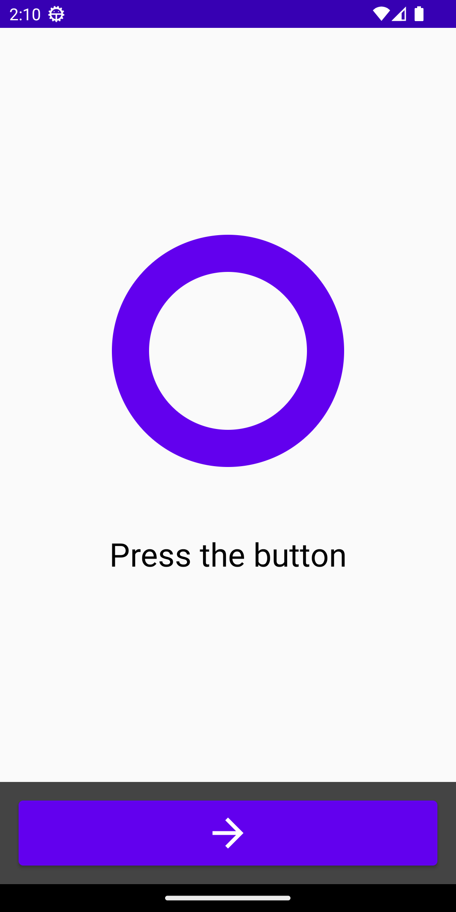
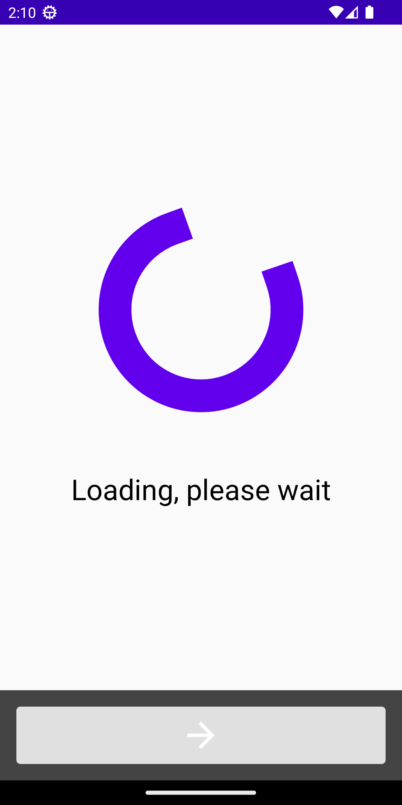
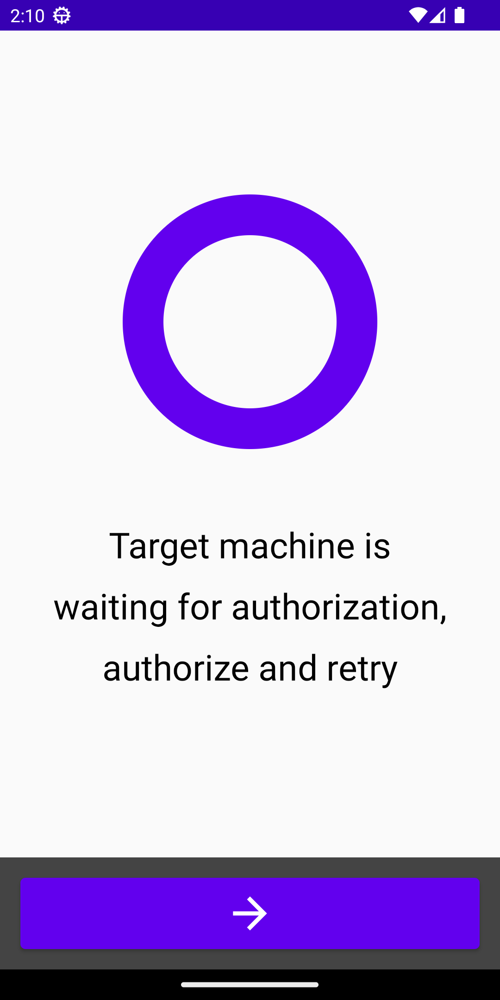

# <samp>HISENDAL</samp>

Android application that uses the [dadb](https://github.com/mobile-dev-inc/dadb) library.

## <samp>GLASSWARE</samp>
## <samp>PROCEDURE</samp>
## <samp>OPERATION</samp>
## <samp>SPECIMENS</samp>
## <samp>REFERENCE</samp>
## <samp>REFERENCE</samp>

## <samp>EXAMPLES</samp>
## <samp>PICTURES</samp>
## <samp>PLATFORM</samp>
## <samp>COMMENTS</samp>
## <samp>ANALYSIS</samp>
## <samp>THOUGHTS</samp>

### Ensure you are on a bridged network

This example will not work on a NAT network, so use a device or an emulator with a bridged network interface.

### Alter the device address

Replace address in [AndroidScreenViewModel.kt](app/src/main/java/com/example/hisendal/AndroidScreenViewModel.kt).

```kotlin
private var address = mutableStateOf("192.168.X.XX")
```

### Force refreshing the keys

Change refresh parameter in [Device.kt](app/src/main/java/com/example/hisendal/Device.kt).

```kotlin
handler = Dadb.discover(address, keygen(refresh = true))
```

## <samp>GLASSWARE</samp>


